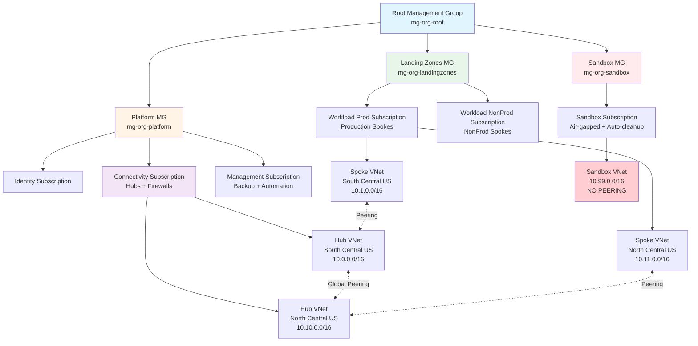

# Azure Landing Zone - Implementation Blueprint

## Overview

This repository contains a **production-ready Azure Landing Zone** designed for rapid deployment with minimal follow-up. It implements Azure best practices for governance, networking, security, and operations using Infrastructure as Code (Terraform) and automated CI/CD (GitHub Actions).

**Key Features**:
- ✅ Dual-region hub-and-spoke architecture (primary + DR)
- ✅ Choice of firewall: Azure Firewall, Palo Alto, or Fortinet
- ✅ Automated sandbox resource cleanup (30-day expiry)
- ✅ Policy-driven governance with Azure Policy
- ✅ GitOps workflow with PR-based approval gates
- ✅ Comprehensive Day 2 operational documentation for junior administrators

---

## Architecture



**Design Principles**:
- **Lean and opinionated**: Standard landing zone without unnecessary complexity
- **CAF-aligned**: Follows Microsoft Cloud Adoption Framework naming and patterns
- **Dual-region**: Primary (South Central US) + DR (North Central US) for production workloads
- **Air-gapped sandbox**: Isolated environment with automatic 30-day resource cleanup
- **GitOps-first**: All changes via GitHub PRs with automated plan/apply

---

## Repository Structure

```
HCW-Demo-LZDeployment/
├── terraform/
│   ├── backend-bootstrap/       # One-time state storage setup
│   ├── modules/                 # Reusable Terraform modules
│   │   ├── management-groups/   # 4-level MG hierarchy
│   │   ├── hub-network/         # Dual-region hubs with firewall
│   │   ├── spoke-network/       # Workload spokes with hub peering
│   │   ├── policy-baseline/     # Azure Policy governance
│   │   └── backup-baseline/     # Recovery Services + Backup Vaults
│   ├── live/                    # Environment-specific deployments
│   │   ├── global/              # Management groups + policies
│   │   ├── platform-connectivity/   # Hubs and firewalls
│   │   ├── platform-management/     # Backup + automation
│   │   ├── workloads-prod/          # Production spokes
│   │   └── sandbox/                 # Isolated sandbox environment
│   └── scripts/                 # PowerShell automation scripts
│       └── Cleanup-ExpiredSandboxResources.ps1
├── .github/workflows/
│   ├── terraform-plan.yml       # PR-based plan and validation
│   └── terraform-apply.yml      # Merge-based deployment with approval
├── docs/
│   ├── architecture.md          # Detailed design documentation
│   └── day2/                    # Operations manual for administrators
│       ├── README.md
│       ├── 01-daily-operations.md
│       ├── 04-incident-triage.md
│       ├── 05-change-management.md
│       ├── 07-sandbox-lifecycle.md
│       └── 10-escalation-matrix.md
├── DEPLOYMENT-GUIDE.md          # Step-by-step deployment instructions
└── README.md                    # This file
```

---

## Getting Started

### Prerequisites
- Azure CLI 2.60+
- Terraform 1.9+
- 6 Azure subscriptions (Identity, Connectivity, Management, Prod, NonProd, Sandbox)
- Owner/User Access Administrator at tenant root
- GitHub repository with Actions enabled

### Quick Start

1. **Clone and review**:
   ```powershell
   git clone https://github.com/saulpatinojr/HCW-Demo-LZDeployment.git
   cd HCW-Demo-LZDeployment
   ```

2. **Bootstrap Terraform state backend**:
   ```powershell
   cd terraform/backend-bootstrap
   # Configure terraform.tfvars with your values
   terraform init
   terraform apply
   ```

3. **Deploy landing zone layers** (in order):
   ```powershell
   # 1. Global (management groups + policies)
   cd ../live/global
   terraform init -backend-config=backend.hcl
   terraform apply

   # 2. Connectivity (hubs + firewalls)
   cd ../platform-connectivity
   terraform init -backend-config=backend.hcl
   terraform apply

   # 3. Management (backup + automation)
   cd ../platform-management
   terraform init -backend-config=backend.hcl
   terraform apply

   # 4. Workloads (production spokes)
   cd ../workloads-prod
   terraform init -backend-config=backend.hcl
   terraform apply

   # 5. Sandbox (isolated environment)
   cd ../sandbox
   terraform init -backend-config=backend.hcl
   terraform apply
   ```

4. **Configure GitHub Actions CI/CD**:
   - Create Entra ID app registration for OIDC
   - Configure federated credentials
   - Add GitHub secrets: `AZURE_CLIENT_ID`, `AZURE_TENANT_ID`, `AZURE_SUBSCRIPTION_ID`

**For detailed deployment instructions**, see [DEPLOYMENT-GUIDE.md](./DEPLOYMENT-GUIDE.md).

---

## Security Status

**Last Audit**: May 28, 2026  
**Security Posture**: 🟡 MODERATE (Production deployment NOT RECOMMENDED until Phase 1 remediations)  
**Compliance Level**: Partially compliant across all frameworks

### Current Status

| Metric | Status | Details |
|---|---|---|
| **Critical Findings** | 🔴 3 open | RBAC overprivilege, state storage exposure, script validation |
| **High Findings** | 🟠 12 open | Missing Defender, CMK, TLS enforcement, flow logs, SIEM |
| **Medium/Low** | 🟡 32 open | Enhancements and best practices |
| **Azure Secure Score** | ⏳ Pending | Will be available after Defender enablement |
| **OWASP Compliance** | 30% | Target: 90% after Phase 3 |
| **Azure Security Baseline** | 30% | Target: 75% after Phase 3 |
| **CIS Azure Foundations** | 40% | Target: 85% after Phase 3 |
| **WCAG 2.1 (Docs)** | 70% | Target: 95% after Phase 4 |

### Positive Security Controls ✅

The following **21 security controls** are already implemented:
- ✅ HTTPS enforcement + TLS 1.2 on state storage
- ✅ Blob versioning + 30-day soft delete
- ✅ OIDC authentication (no long-lived secrets)
- ✅ No hardcoded secrets in code
- ✅ Hub-spoke network topology with NSGs
- ✅ Sandbox air-gap via Azure Policy
- ✅ Mandatory tagging enforced
- ✅ Management group hierarchy
- ✅ PR-based approval workflow
- ✅ Geo-redundant state storage (RA-GZRS)
- ✅ Azure Basic DDoS protection (free, enabled by default)

**[View all positive findings →](docs/compliance/PRE-REMEDIATION-STATUS-2026-05-28.md#positive-security-controls-already-implemented-)**

### Critical Remediations Required (Phase 1 - 0-30 days)

Before production deployment, the following **MUST** be completed:

1. **🔴 Service Principal RBAC Validation** (CVSS 9.1)
   - Verify GitHub Actions SP has Contributor (not Owner)
   - Scope service principals per subscription
   - Add RBAC validation to CI/CD pipeline
   - **Effort**: 8 hours | **Cost**: $0

2. **🔴 Secure Terraform State Storage** (CVSS 8.2)
   - Disable public network access on state storage
   - Deploy private endpoint
   - Configure firewall rules
   - **Effort**: 4 hours | **Cost**: $40/month

3. **🔴 PowerShell Input Validation** (CVSS 7.5)
   - Add GUID validation to sandbox cleanup script
   - Implement subscription tag validation
   - Add resource deletion safety limits
   - **Effort**: 2 hours | **Cost**: $0

4. **🔴 Enable Microsoft Defender for Cloud**
   - Enable Defender plans across all subscriptions
   - Configure security alerts
   - Establish security response procedures
   - **Effort**: 6 hours | **Cost**: $1,500-$3,000/month

5. **🔴 Enable GitHub Secret Scanning**
   - Enable push protection
   - Configure Dependabot
   - Add TruffleHog workflow
   - **Effort**: 2 hours | **Cost**: $0

**Phase 1 Total**: 22 hours | $1,540/month | **60% risk reduction**

### Audit Reports

- 📊 **[Security Audit Report](docs/compliance/SECURITY-AUDIT-REPORT-2026-05-28.md)** - Complete 56-finding analysis across OWASP, Azure Security Baseline, CIS, WCAG
- 📋 **[Executive Summary](docs/compliance/EXECUTIVE-SUMMARY-2026-05-28.md)** - Leadership-focused overview with cost/benefit analysis
- ✅ **[Quick Action Checklist](docs/compliance/QUICK-ACTION-CHECKLIST.md)** - Immediate action items with exact commands
- 📸 **[Pre-Remediation Baseline](docs/compliance/PRE-REMEDIATION-STATUS-2026-05-28.md)** - Security posture snapshot before remediation

### Remediation Roadmap

| Phase | Timeline | Effort | Monthly Cost | Risk Reduction | Key Deliverables |
|---|---|---|---|---|---|
| **Phase 1** | 0-30 days | 22h | $1,540 | 60% | Critical fixes, Defender enabled, secure state storage |
| **Phase 2** | 30-90 days | 43h | +$750 | 25% | CMK encryption, SIEM, flow logs, threat intelligence |
| **Phase 3** | 90-180 days | 60h | +$350 | 10% | Private endpoints, resource locks, comprehensive logging |
| **Phase 4** | Ongoing | 40h | $0 | 5% | Documentation, hardening, operational excellence |

**Total Investment**: 165 hours | $2,510/month recurring | $30,120/year

**[View detailed remediation plan →](TODO.md)**

---

## Key Features

### 1. Firewall Choice
Select at deployment time:
- **Azure Firewall** (`azfw`): Native Azure, fully managed
- **Palo Alto** (`palo`): Enterprise security with advanced threat prevention
- **Fortinet** (`fortinet`): Next-gen firewall with unified threat management

Configured via `firewall_type` variable in `platform-connectivity` layer.

### 2. Automated Sandbox Cleanup
- **Policy**: All sandbox resources must have `expiry_date` tag (YYYY-MM-DD format)
- **Automation**: Daily runbook at 02:00 UTC deletes resources > 30 days old
- **Air-gap**: Policy denies VNet peering to prevent production connectivity

### 3. Governance with Azure Policy
Six policies enforced:
- Mandatory tags (owner, application, environment)
- Allowed locations (primary and DR regions only)
- NSG requirement on all subnets
- Sandbox environment tag enforcement
- Sandbox expiry date requirement
- Deny sandbox VNet peering

### 4. GitOps Workflow
- **PR opened** → `terraform plan` runs, posts results to PR
- **PR merged** → `terraform apply` runs with approval gate
- **Environment protection** → Requires team lead approval for production changes
- **Sequential deployment** → Prevents race conditions with state locks

### 5. Dual-Region DR
- **Primary**: South Central US
- **DR**: North Central US
- **Global peering**: Hub-to-hub connectivity across regions
- **Spoke replication**: Production spokes exist in both regions
- **Backup**: Recovery Services Vaults in both regions with GeoRedundant storage

---

## Day 2 Operations

Comprehensive operational documentation for junior cloud administrators:

| Document | Purpose | Frequency |
|---|---|---|
| [Daily Operations](./docs/day2/01-daily-operations.md) | 7-step health check (15-20 min) | Daily |
| [Incident Triage](./docs/day2/04-incident-triage.md) | Response procedures for 6 common incidents | As needed |
| [Change Management](./docs/day2/05-change-management.md) | PR workflow, approval gates, rollback procedures | Per change |
| [Sandbox Lifecycle](./docs/day2/07-sandbox-lifecycle.md) | Manage expiry, cleanup automation, user requests | Daily/weekly |
| [Escalation Matrix](./docs/day2/10-escalation-matrix.md) | Who to contact, when, and how | Reference |

**Daily checklist includes**:
1. Azure Service Health review
2. Backup job status verification
3. Firewall health metrics
4. Policy compliance check
5. Sandbox expiry report
6. Security alerts review
7. Terraform state backend health

---

## Technology Stack

| Component | Technology | Version |
|---|---|---|
| IaC | Terraform | 1.9+ |
| Cloud Provider | Azure | azurerm provider ~> 4.2 |
| CI/CD | GitHub Actions | - |
| Authentication | OIDC (Federated Identity) | - |
| State Backend | Azure Storage (blob) | RA-GZRS replication |
| Automation | Azure Automation Account | PowerShell 7.2+ runbooks |
| Governance | Azure Policy | Built-in + custom policies |
| Naming | Microsoft CAF | Standard abbreviations |

---

## Support and Contribution

### Getting Help
- **Documentation**: Start with [docs/day2/README.md](./docs/day2/README.md)
- **Deployment issues**: See [DEPLOYMENT-GUIDE.md](./DEPLOYMENT-GUIDE.md)
- **Slack**: #azure-platform-support
- **Email**: azure-platform-team@company.com

### Reporting Issues
Please include:
- Layer affected (global, platform-connectivity, etc.)
- Terraform version and provider versions
- Error message (full output)
- Steps to reproduce

---

## License

[Specify your license here, e.g., MIT, Apache 2.0]

---

## Acknowledgments

This landing zone design follows:
- [Microsoft Cloud Adoption Framework](https://learn.microsoft.com/azure/cloud-adoption-framework/)
- [Azure Landing Zone Accelerator](https://learn.microsoft.com/azure/cloud-adoption-framework/ready/landing-zone/)
- [Azure Naming Conventions](https://learn.microsoft.com/azure/azure-resource-manager/management/resource-name-rules)

---

**Platform Team**  
Email: azure-platform-team@company.com  
Slack: #azure-platform-support

---

## Next Steps

### For New Deployments

**⚠️ WARNING**: Do NOT deploy to production without completing Phase 1 security remediations.

1. **Review Security Baseline** (30 minutes)
   - Read [Pre-Remediation Status Report](docs/compliance/PRE-REMEDIATION-STATUS-2026-05-28.md)
   - Review [Executive Summary](docs/compliance/EXECUTIVE-SUMMARY-2026-05-28.md) with leadership
   - Understand current risk level: 🟡 MODERATE

2. **Complete Critical Security Fixes** (22 hours / 3 days)
   - Start with [TODO.md](TODO.md) Phase 1 tasks
   - Follow [Quick Action Checklist](docs/compliance/QUICK-ACTION-CHECKLIST.md)
   - Address all 5 critical findings:
     - Service principal RBAC validation
     - Private endpoint for state storage
     - PowerShell input validation
     - Enable Microsoft Defender for Cloud
     - Enable GitHub secret scanning

3. **Deploy Landing Zone** (2-4 hours)
   - Follow [Deployment Guide](docs/DEPLOYMENT-GUIDE.md)
   - Start with backend bootstrap → global → connectivity → management
   - Test each layer before proceeding

4. **Verify Deployment** (1 hour)
   - Run daily health check: [docs/day2/01-daily-operations.md](docs/day2/01-daily-operations.md)
   - Verify Defender recommendations in Azure Portal
   - Check Azure Secure Score (target: 70%+)

5. **Schedule Phase 2 Work** (Within 60 days)
   - Customer-managed keys (CMK)
   - Azure Sentinel deployment
   - NSG flow logs enablement
   - TLS 1.2 policy enforcement
   - See [TODO.md](TODO.md) Phase 2 for details

### For Existing Deployments

**Current Deployments**: 🟡 Security audit completed May 28, 2026

1. **Immediate Actions** (This week)
   - [ ] Review [Security Audit Report](docs/compliance/SECURITY-AUDIT-REPORT-2026-05-28.md) with security team
   - [ ] Schedule kick-off meeting for Phase 1 remediations
   - [ ] Approve budget: $1,540/month for Phase 1 security controls
   - [ ] Assign tasks from [TODO.md](TODO.md) to engineering team
   - [ ] Create GitHub issues for each Phase 1 finding

2. **Critical Path** (0-30 days)
   - Week 1: Service principal RBAC scoping (8h)
   - Week 2: State storage private endpoint + PowerShell fixes (6h)
   - Week 3: Microsoft Defender enablement (6h)
   - Week 4: GitHub secret scanning + validation (2h)
   - **Target**: Reduce risk from MODERATE 🟡 to LOW 🟢

3. **Compliance Monitoring** (Ongoing)
   - Weekly: Security working group meeting
   - Monthly: Review Azure Secure Score and Defender recommendations
   - Quarterly: External security audit
   - Track progress in [TODO.md](TODO.md) task checklist

4. **Continuous Improvement**
   - Phase 2 (30-90 days): High priority findings ($750/month)
   - Phase 3 (90-180 days): Medium priority findings ($350/month)
   - Phase 4 (Ongoing): Low priority and documentation

### Success Metrics

Track these KPIs weekly:

| Metric | Current | 30-Day Target | 90-Day Target | 180-Day Target |
|---|---|---|---|---|
| Critical Findings | 3 | 0 ✅ | 0 ✅ | 0 ✅ |
| High Findings | 12 | 3 | 0 ✅ | 0 ✅ |
| Azure Secure Score | Unknown | 70% | 80% | 85% |
| OWASP Compliance | 30% | 75% | 85% | 90% |
| CIS Compliance | 40% | 60% | 75% | 85% |

---

## Quick Start

### 1. Bootstrap Terraform State Backend

```powershell
cd terraform/backend-bootstrap
terraform init
terraform plan -out=tfplan
terraform apply tfplan
```

This creates the secure storage account for remote state.

### 2. Configure Variables

Copy and customize the variable files:

```powershell
cp terraform/live/global/terraform.tfvars.example terraform/live/global/terraform.tfvars
```

Edit `terraform.tfvars` with your values:
- Organization prefix
- Subscription IDs
- Address spaces
- Firewall selection (azfw, palo, fortinet)
- Tags

### 3. Deploy via GitHub Actions

Push to a feature branch and open a PR. GitHub Actions will:
1. Run `terraform plan`
2. Post plan summary to PR
3. Wait for approval (on merge to main)
4. Execute `terraform apply`

Or deploy manually:

```powershell
cd terraform/live/global
terraform init -backend-config=backend.hcl
terraform plan -out=tfplan
terraform apply tfplan
```

## Deployment Sequence

Execute in this order to satisfy dependencies:

1. **Global**: Management groups + policies
2. **Platform Connectivity**: Dual-region hubs with firewall
3. **Platform Management**: Monitoring, backup vaults, Log Analytics
4. **Workload Networks**: Spoke VNets with hub peering
5. **Sandbox**: Isolated network with expiry policies
6. **RBAC**: Role assignments across all scopes

## Naming Convention

Follows [Microsoft CAF naming standards](https://learn.microsoft.com/en-us/azure/cloud-adoption-framework/ready/azure-best-practices/resource-naming):

- Management Groups: `mg-{scope}`
- Subscriptions: `sub-{scope}-{env}`
- Resource Groups: `rg-{scope}-{region}-{env}-{nn}`
- Resources: `{type}-{name}-{region}-{env}-{nn}`

Examples:
- `mg-platform`
- `vnet-hub-scus-prod-01`
- `nsg-spoke-app-scus-prod-01`
- `azfw-hub-scus-prod-01`

Abbreviations: [CAF Resource Abbreviations](https://learn.microsoft.com/en-us/azure/cloud-adoption-framework/ready/azure-best-practices/resource-abbreviations)

## Tagging Strategy

Mandatory tags on all resources:

- `owner` (required, no default)
- `application` (required)
- `environment` (required: prod, nonprod, sandbox)
- `cost_center` (required)

Sandbox resources automatically tagged with `expiry_date` (30 days from creation).

## Firewall Options

At deployment time, choose one of:

1. **Azure Firewall** (azfw): Managed PaaS, integrated logging, simple rules
2. **Palo Alto VM-Series** (palo): Marketplace NVA, advanced threat prevention
3. **Fortinet FortiGate** (fortinet): Marketplace NVA, NGFW with IPS/IDS

The hub module provisions appropriate subnets and routes based on your choice.

## Sandbox Auto-Expiry

Sandbox resources with `expiry_date` tag older than 30 days are automatically deleted by an Azure Automation runbook running daily at 02:00 UTC.

Manual trigger:

```powershell
az automation runbook start `
  --automation-account-name aa-platform-scus-prod-01 `
  --resource-group rg-management-scus-prod-01 `
  --name Cleanup-ExpiredSandboxResources
```

## GitHub Actions Workflows

- **`terraform-plan.yml`**: Runs on PR (fmt, validate, plan)
- **`terraform-apply.yml`**: Runs on merge to main (apply with approval)
- **`terraform-destroy.yml`**: Manual workflow for teardown
- **`compliance-scan.yml`**: Weekly policy compliance check

### OIDC Setup

Follow [Azure OIDC for GitHub Actions](https://learn.microsoft.com/en-us/azure/developer/github/connect-from-azure) to create federated credentials.

Required federated credential subjects:
- `repo:saulpatinojr/HCW-Demo-LZDeployment:ref:refs/heads/main`
- `repo:saulpatinojr/HCW-Demo-LZDeployment:pull_request`

## State Management

- Backend: Azure Storage with private endpoint
- State locking: Blob lease
- Separate state file per layer
- State encryption at rest
- Soft delete + versioning enabled

## Operations

See [Day 2 Documentation](docs/day2/) for:

- Daily/weekly/monthly checklists
- Incident triage guide
- Change management procedures
- DR test procedures
- Access request workflows

## Support

For issues or questions:
1. Check [docs/day2/](docs/day2/) runbooks
2. Review Terraform plan output
3. Check GitHub Actions logs
4. Escalate to platform team

## License

Internal use only.
