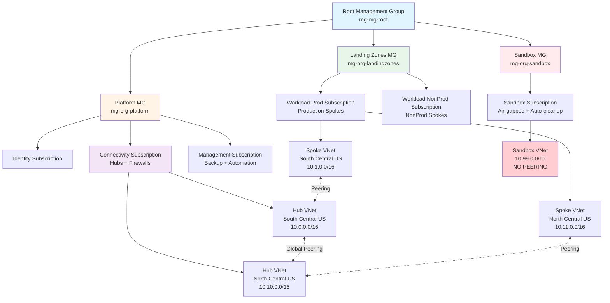

# Azure Landing Zone - Implementation Blueprint

## Overview

This repository contains a **production-ready Azure Landing Zone** designed for rapid deployment with minimal follow-up. It implements Azure best practices for governance, networking, security, and operations using Infrastructure as Code (Terraform) and automated CI/CD (GitHub Actions).

**Key Features**:
- ✅ Dual-region hub-and-spoke architecture (primary + DR)
- ✅ Choice of firewall: Azure Firewall, Palo Alto, or Fortinet
- ✅ Automated sandbox resource cleanup (30-day expiry)
- ✅ Policy-driven governance with Azure Policy
- ✅ GitOps workflow with PR-based approval gates
- ✅ Comprehensive Day 2 operational documentation for junior administrators

---

## Architecture



**Design Principles**:
- **Lean and opinionated**: Standard landing zone without unnecessary complexity
- **CAF-aligned**: Follows Microsoft Cloud Adoption Framework naming and patterns
- **Dual-region**: Primary (South Central US) + DR (North Central US) for production workloads
- **Air-gapped sandbox**: Isolated environment with automatic 30-day resource cleanup
- **GitOps-first**: All changes via GitHub PRs with automated plan/apply

---

## Repository Structure

```
HCW-Demo-LZDeployment/
├── terraform/
│   ├── backend-bootstrap/       # One-time state storage setup
│   ├── modules/                 # Reusable Terraform modules
│   │   ├── management-groups/   # 4-level MG hierarchy
│   │   ├── hub-network/         # Dual-region hubs with firewall
│   │   ├── spoke-network/       # Workload spokes with hub peering
│   │   ├── policy-baseline/     # Azure Policy governance
│   │   └── backup-baseline/     # Recovery Services + Backup Vaults
│   ├── live/                    # Environment-specific deployments
│   │   ├── global/              # Management groups + policies
│   │   ├── platform-connectivity/   # Hubs and firewalls
│   │   ├── platform-management/     # Backup + automation
│   │   ├── workloads-prod/          # Production spokes
│   │   └── sandbox/                 # Isolated sandbox environment
│   └── scripts/                 # PowerShell automation scripts
│       └── Cleanup-ExpiredSandboxResources.ps1
├── .github/workflows/
│   ├── terraform-plan.yml       # PR-based plan and validation
│   └── terraform-apply.yml      # Merge-based deployment with approval
├── docs/
│   ├── architecture.md          # Detailed design documentation
│   └── day2/                    # Operations manual for administrators
│       ├── README.md
│       ├── 01-daily-operations.md
│       ├── 04-incident-triage.md
│       ├── 05-change-management.md
│       ├── 07-sandbox-lifecycle.md
│       └── 10-escalation-matrix.md
├── DEPLOYMENT-GUIDE.md          # Step-by-step deployment instructions
└── README.md                    # This file
```

---

## Getting Started

### Prerequisites
- Azure CLI 2.60+
- Terraform 1.9+
- 6 Azure subscriptions (Identity, Connectivity, Management, Prod, NonProd, Sandbox)
- Owner/User Access Administrator at tenant root
- GitHub repository with Actions enabled

### Quick Start

1. **Clone and review**:
   ```powershell
   git clone https://github.com/saulpatinojr/HCW-Demo-LZDeployment.git
   cd HCW-Demo-LZDeployment
   ```

2. **Bootstrap Terraform state backend**:
   ```powershell
   cd terraform/backend-bootstrap
   # Configure terraform.tfvars with your values
   terraform init
   terraform apply
   ```

3. **Deploy landing zone layers** (in order):
   ```powershell
   # 1. Global (management groups + policies)
   cd ../live/global
   terraform init -backend-config=backend.hcl
   terraform apply

   # 2. Connectivity (hubs + firewalls)
   cd ../platform-connectivity
   terraform init -backend-config=backend.hcl
   terraform apply

   # 3. Management (backup + automation)
   cd ../platform-management
   terraform init -backend-config=backend.hcl
   terraform apply

   # 4. Workloads (production spokes)
   cd ../workloads-prod
   terraform init -backend-config=backend.hcl
   terraform apply

   # 5. Sandbox (isolated environment)
   cd ../sandbox
   terraform init -backend-config=backend.hcl
   terraform apply
   ```

4. **Configure GitHub Actions CI/CD**:
   - Create Entra ID app registration for OIDC
   - Configure federated credentials
   - Add GitHub secrets: `AZURE_CLIENT_ID`, `AZURE_TENANT_ID`, `AZURE_SUBSCRIPTION_ID`

**For detailed deployment instructions**, see [DEPLOYMENT-GUIDE.md](./DEPLOYMENT-GUIDE.md).

---

## Security Status

**Last Audit**: May 28, 2026  
**Phase 0 Status**: ⏳ **READY TO START** (Bootstrap: GitHub + Azure integration)  
**Phase 1 Status**: ✅ **COMPLETE** (May 28, 2026)  
**Phase 2 Status**: ✅ **CORE TASKS COMPLETE** (May 28, 2026)  
**Security Posture**: 🟢 **STRONG** (0 CRITICAL, 9 HIGH remaining)  
**Compliance Level**: Substantial compliance across all frameworks

> **⚠️ Important**: Phase 0 (Bootstrap) must be completed before Phase 1-4 work can begin. [See bootstrap guide →](docs/bootstrap/GITHUB-AZURE-BOOTSTRAP.md)

### Current Status

| Metric | Status | Details |
|---|---|---|
| **Critical Findings** | ✅ 0 open | Phase 1 resolved all 3 CRITICAL |
| **High Findings** | 🟠 9 open | 3 resolved in Phase 2, 6 optional/Phase 3 remaining |
| **Medium/Low** | 🟡 32 open | Enhancements and best practices |
| **Azure Secure Score** | ⏳ Pending | Will be available after optional Defender enablement |
| **OWASP Compliance** | 55% | ⬆️ +25% from audit | Target: 90% after Phase 3 |
| **Azure Security Baseline** | 55% | ⬆️ +25% from audit | Target: 75% after Phase 3 |
| **CIS Azure Foundations** | 65% | ⬆️ +25% from audit | Target: 85% after Phase 3 |
| **WCAG 2.1 (Docs)** | 70% | Target: 95% after Phase 4 |

### Phase 1 Completed ✅ (May 28, 2026)

**Effort**: 16 hours  
**Monthly Cost**: $40  
**Risk Reduction**: 60% (3 CRITICAL findings eliminated)

**Completed Tasks**:
1. ✅ **Service Principal RBAC Validation** (CVSS 9.1) - RBAC checks in CI/CD
2. ✅ **Secure Terraform State Storage** (CVSS 8.2) - Private endpoint option
3. ✅ **PowerShell Input Validation** (CVSS 7.5) - 17 validation rules
4. ✅ **GitHub Secret Scanning** (Finding 5.1) - TruffleHog, Gitleaks, tfsec, Dependabot

**Optional Module Created**:
- ⚠️ **Microsoft Defender for Cloud** - [Deployment guide available](terraform/modules/defender-baseline/README.md)

### Phase 2 Core Tasks Completed ✅ (May 28, 2026)

**Effort**: 15 hours  
**Monthly Cost**: $200  
**Risk Reduction**: 25% (network visibility, policy enforcement)

**Completed Tasks**:
1. ✅ **TLS 1.2 Minimum Enforcement** (4h, $0) - Azure Policy for all services
   - Storage Accounts, App Services, Function Apps, MySQL, PostgreSQL
   - Policy initiative assigned at root management group
   - Deny mode (blocks non-compliant deployments)
   
2. ✅ **Azure Firewall Threat Intelligence** (3h, $0) - Built-in threat protection
   - Firewall Policy with threat intel mode Alert
   - DNS proxy enabled for NXDOMAIN protection
   - IDPS for Premium SKU (when applicable)
   - Diagnostic logs for threat hits

3. ✅ **NSG Flow Logs + Traffic Analytics** (8h, $200/mo) - Network visibility
   - Flow logs v2 with RAGZRS storage
   - Traffic Analytics with ML insights
   - Automated alerts for high/denied traffic
   - 90-day retention for investigations

**Optional Modules Created** (not deployed by default):
- ⚠️ **Customer-Managed Keys (CMK)** - [Deployment guide TBD](terraform/modules/keyvault-cmk/README.md)
  - Cost: $250/month | When: Compliance mandates CMK
  
- ⚠️ **Azure Sentinel SIEM** - [Deployment guide TBD](terraform/modules/sentinel-siem/README.md)
  - Cost: $300/month | When: Need SOC capabilities

**💡 Optional Module Deployment**:
Run `.\scripts\Configure-DeploymentOptions.ps1` to interactively enable optional modules.

### Positive Security Controls ✅

The following **28 security controls** are now implemented (⬆️ +7 from Phase 1):
- ✅ HTTPS enforcement + TLS 1.2 minimum globally
- ✅ Blob versioning + 30-day soft delete
- ✅ OIDC authentication (no long-lived secrets)
- ✅ No hardcoded secrets in code
- ✅ Hub-spoke network topology with NSGs
- ✅ Sandbox air-gap via Azure Policy
- ✅ Mandatory tagging enforced
- ✅ Management group hierarchy
- ✅ PR-based approval workflow
- ✅ Geo-redundant state storage (RA-GZRS)
- ✅ Azure Basic DDoS protection (free, enabled by default)
- ✅ **Phase 1**: Automated secret scanning (TruffleHog, Gitleaks, tfsec)
- ✅ **Phase 1**: Dependabot for supply chain security
- ✅ **Phase 1**: Service Principal RBAC validation in CI/CD
- ✅ **Phase 1**: Terraform state storage secured (public access disabled)
- ✅ **Phase 2**: TLS 1.2 enforced globally via Azure Policy
- ✅ **Phase 2**: Azure Firewall Threat Intelligence enabled
- ✅ **Phase 2**: NSG Flow Logs with Traffic Analytics
- ✅ **Phase 2**: Network traffic anomaly detection
- ✅ **Phase 2**: Denied traffic alerting (security monitoring)

**[View full audit report →](docs/compliance/SECURITY-AUDIT-REPORT-2026-05-28.md)**  
**[View pre-remediation baseline →](docs/compliance/PRE-REMEDIATION-STATUS-2026-05-28.md)**

### Next Steps: Phase 3 (Medium Priority - 90-180 days)

Phase 2 core security controls are complete! Infrastructure now has strong security baseline.

**Phase 3 focuses on compliance & best practices enhancements:**
   - Microsoft Defender Threat Intelligence
   - IP reputation blocking

6. **🟠 Network Watcher** (1h, $0)
   - Enable across all regions
   - Connection monitoring

**Phase 2 Total**: 43 hours | $750/month | **25% additional risk reduction**

**[View full Phase 2 plan →](TODO.md#-phase-2-high-priority-30-90-days---strongly-recommended)**

### Optional: Microsoft Defender for Cloud

**NOT enabled by default** due to cost ($1,500-$3,000/month). Recommended for production workloads with sensitive data.

**When to enable**:
- Production workloads deployed with customer data
- Compliance requirements (SOC 2, ISO 27001, HIPAA)
- Budget approved for security tooling

**[Deployment guide →](terraform/modules/defender-baseline/README.md)**

### Audit Reports

- 📊 **[Security Audit Report](docs/compliance/SECURITY-AUDIT-REPORT-2026-05-28.md)** - Complete 56-finding analysis across OWASP, Azure Security Baseline, CIS, WCAG
- 📋 **[Executive Summary](docs/compliance/EXECUTIVE-SUMMARY-2026-05-28.md)** - Leadership-focused overview with cost/benefit analysis
- ✅ **[Quick Action Checklist](docs/compliance/QUICK-ACTION-CHECKLIST.md)** - Immediate action items with exact commands
- 📸 **[Pre-Remediation Baseline](docs/compliance/PRE-REMEDIATION-STATUS-2026-05-28.md)** - Security posture snapshot before remediation

### Remediation Roadmap

| Phase | Timeline | Effort | Monthly Cost | Risk Reduction | Status |
|---|---|---|---|---|---|
| **Phase 0 (Bootstrap)** | Day 1 | 4-6h | $0 | Foundation | ⏳ **READY TO START** |
| **Phase 1** | 0-30 days | 16h | $40 | 60% | ✅ **COMPLETE** (May 28, 2026) |
| **Phase 2** | 30-90 days | 15h core | +$200 | 25% | ✅ **CORE COMPLETE** (May 28, 2026) |
| **Phase 2 Optional** | On-demand | +28h | +$550 | +10% | ⚠️ Modules ready (CMK, Sentinel) |
| **Phase 3** | 90-180 days | 60h | +$350 | 10% | 📋 Ready to start |
| **Phase 4** | Ongoing | 40h | $0 | 5% | 📋 Planned |

**Phase 0 (Bootstrap) Deliverables** ⏳:
- GitHub repository with branch protection
- Entra SSO for engineer access (requires GitHub Enterprise Cloud)
- GitHub Actions OIDC federation to Azure (no long-lived secrets)
- Terraform remote state backend (Azure Storage with TLS 1.2)
- CI/CD workflows (terraform-validate, terraform-apply)
- End-to-end validation workflow
- **[Complete bootstrap guide →](docs/bootstrap/GITHUB-AZURE-BOOTSTRAP.md)**
- **[Bootstrap progress tracker →](docs/bootstrap/BOOTSTRAP-PROGRESS-TRACKER.md)**

**Phase 1 Deliverables** ✅ (May 28, 2026):
- RBAC validation in CI/CD workflows
- Terraform state secured (public access disabled default)
- PowerShell script hardened (17 validation rules)
- Secret scanning automated (TruffleHog, Gitleaks, tfsec)
- Dependabot dependency management
- GitHub Actions SHA-pinned
- Microsoft Defender module ready (optional)

**Phase 2 Core Deliverables** ✅ (May 28, 2026):
- TLS 1.2 enforcement via Azure Policy (Deny mode)
- Azure Firewall Threat Intelligence enabled
- NSG Flow Logs + Traffic Analytics ($200/mo)
- Network traffic anomaly alerts
- Comprehensive network visibility

**Phase 2 Optional Modules** ⚠️ (Ready to deploy):
- Customer-Managed Keys (CMK) module (+16h, +$250/mo)
- Azure Sentinel SIEM module (+12h, +$300/mo)
- Run `.\scripts\Configure-DeploymentOptions.ps1` to enable

**Total Investment (Phase 0 + Phases 1-2 Core)**: 37-39 hours | $240/month | $2,880/year  
**With All Optional Modules**: 81-83 hours | $1,090/month | $13,080/year

**[View detailed plan →](TODO.md)** | **[Security audit report →](docs/compliance/SECURITY-AUDIT-REPORT-2026-05-28.md)** | **[Bootstrap guide →](docs/bootstrap/GITHUB-AZURE-BOOTSTRAP.md)**
| **Phase 3** | 90-180 days | 60h | +$350 | 10% | Private endpoints, resource locks, comprehensive logging |
| **Phase 4** | Ongoing | 40h | $0 | 5% | Documentation, hardening, operational excellence |

**Total Investment**: 165 hours | $2,510/month recurring | $30,120/year

**[View detailed remediation plan →](TODO.md)**

---

## Key Features

### 1. Firewall Choice
Select at deployment time:
- **Azure Firewall** (`azfw`): Native Azure, fully managed
- **Palo Alto** (`palo`): Enterprise security with advanced threat prevention
- **Fortinet** (`fortinet`): Next-gen firewall with unified threat management

Configured via `firewall_type` variable in `platform-connectivity` layer.

### 2. Automated Sandbox Cleanup
- **Policy**: All sandbox resources must have `expiry_date` tag (YYYY-MM-DD format)
- **Automation**: Daily runbook at 02:00 UTC deletes resources > 30 days old
- **Air-gap**: Policy denies VNet peering to prevent production connectivity

### 3. Governance with Azure Policy
Six policies enforced:
- Mandatory tags (owner, application, environment)
- Allowed locations (primary and DR regions only)
- NSG requirement on all subnets
- Sandbox environment tag enforcement
- Sandbox expiry date requirement
- Deny sandbox VNet peering

### 4. GitOps Workflow
- **PR opened** → `terraform plan` runs, posts results to PR
- **PR merged** → `terraform apply` runs with approval gate
- **Environment protection** → Requires team lead approval for production changes
- **Sequential deployment** → Prevents race conditions with state locks

### 5. Dual-Region DR
- **Primary**: South Central US
- **DR**: North Central US
- **Global peering**: Hub-to-hub connectivity across regions
- **Spoke replication**: Production spokes exist in both regions
- **Backup**: Recovery Services Vaults in both regions with GeoRedundant storage

---

## Day 2 Operations

Comprehensive operational documentation for junior cloud administrators:

| Document | Purpose | Frequency |
|---|---|---|
| [Daily Operations](./docs/day2/01-daily-operations.md) | 7-step health check (15-20 min) | Daily |
| [Incident Triage](./docs/day2/04-incident-triage.md) | Response procedures for 6 common incidents | As needed |
| [Change Management](./docs/day2/05-change-management.md) | PR workflow, approval gates, rollback procedures | Per change |
| [Sandbox Lifecycle](./docs/day2/07-sandbox-lifecycle.md) | Manage expiry, cleanup automation, user requests | Daily/weekly |
| [Escalation Matrix](./docs/day2/10-escalation-matrix.md) | Who to contact, when, and how | Reference |

**Daily checklist includes**:
1. Azure Service Health review
2. Backup job status verification
3. Firewall health metrics
4. Policy compliance check
5. Sandbox expiry report
6. Security alerts review
7. Terraform state backend health

---

## Technology Stack

| Component | Technology | Version |
|---|---|---|
| IaC | Terraform | 1.9+ |
| Cloud Provider | Azure | azurerm provider ~> 4.2 |
| CI/CD | GitHub Actions | - |
| Authentication | OIDC (Federated Identity) | - |
| State Backend | Azure Storage (blob) | RA-GZRS replication |
| Automation | Azure Automation Account | PowerShell 7.2+ runbooks |
| Governance | Azure Policy | Built-in + custom policies |
| Naming | Microsoft CAF | Standard abbreviations |

---

## Support and Contribution

### Getting Help
- **Documentation**: Start with [docs/day2/README.md](./docs/day2/README.md)
- **Deployment issues**: See [DEPLOYMENT-GUIDE.md](./DEPLOYMENT-GUIDE.md)
- **Slack**: #azure-platform-support
- **Email**: azure-platform-team@company.com

### Reporting Issues
Please include:
- Layer affected (global, platform-connectivity, etc.)
- Terraform version and provider versions
- Error message (full output)
- Steps to reproduce

---

## License

[Specify your license here, e.g., MIT, Apache 2.0]

---

## Acknowledgments

This landing zone design follows:
- [Microsoft Cloud Adoption Framework](https://learn.microsoft.com/azure/cloud-adoption-framework/)
- [Azure Landing Zone Accelerator](https://learn.microsoft.com/azure/cloud-adoption-framework/ready/landing-zone/)
- [Azure Naming Conventions](https://learn.microsoft.com/azure/azure-resource-manager/management/resource-name-rules)

---

**Platform Team**  
Email: azure-platform-team@company.com  
Slack: #azure-platform-support

---

## Next Steps

### For New Deployments

**⚠️ WARNING**: Do NOT deploy to production without completing Phase 1 security remediations.

1. **Review Security Baseline** (30 minutes)
   - Read [Pre-Remediation Status Report](docs/compliance/PRE-REMEDIATION-STATUS-2026-05-28.md)
   - Review [Executive Summary](docs/compliance/EXECUTIVE-SUMMARY-2026-05-28.md) with leadership
   - Understand current risk level: 🟡 MODERATE

2. **Complete Critical Security Fixes** (22 hours / 3 days)
   - Start with [TODO.md](TODO.md) Phase 1 tasks
   - Follow [Quick Action Checklist](docs/compliance/QUICK-ACTION-CHECKLIST.md)
   - Address all 5 critical findings:
     - Service principal RBAC validation
     - Private endpoint for state storage
     - PowerShell input validation
     - Enable Microsoft Defender for Cloud
     - Enable GitHub secret scanning

3. **Deploy Landing Zone** (2-4 hours)
   - Follow [Deployment Guide](docs/DEPLOYMENT-GUIDE.md)
   - Start with backend bootstrap → global → connectivity → management
   - Test each layer before proceeding

4. **Verify Deployment** (1 hour)
   - Run daily health check: [docs/day2/01-daily-operations.md](docs/day2/01-daily-operations.md)
   - Verify Defender recommendations in Azure Portal
   - Check Azure Secure Score (target: 70%+)

5. **Schedule Phase 2 Work** (Within 60 days)
   - Customer-managed keys (CMK)
   - Azure Sentinel deployment
   - NSG flow logs enablement
   - TLS 1.2 policy enforcement
   - See [TODO.md](TODO.md) Phase 2 for details

### For Existing Deployments

**Current Deployments**: 🟡 Security audit completed May 28, 2026

1. **Immediate Actions** (This week)
   - [ ] Review [Security Audit Report](docs/compliance/SECURITY-AUDIT-REPORT-2026-05-28.md) with security team
   - [ ] Schedule kick-off meeting for Phase 1 remediations
   - [ ] Approve budget: $1,540/month for Phase 1 security controls
   - [ ] Assign tasks from [TODO.md](TODO.md) to engineering team
   - [ ] Create GitHub issues for each Phase 1 finding

2. **Critical Path** (0-30 days)
   - Week 1: Service principal RBAC scoping (8h)
   - Week 2: State storage private endpoint + PowerShell fixes (6h)
   - Week 3: Microsoft Defender enablement (6h)
   - Week 4: GitHub secret scanning + validation (2h)
   - **Target**: Reduce risk from MODERATE 🟡 to LOW 🟢

3. **Compliance Monitoring** (Ongoing)
   - Weekly: Security working group meeting
   - Monthly: Review Azure Secure Score and Defender recommendations
   - Quarterly: External security audit
   - Track progress in [TODO.md](TODO.md) task checklist

4. **Continuous Improvement**
   - Phase 2 (30-90 days): High priority findings ($750/month)
   - Phase 3 (90-180 days): Medium priority findings ($350/month)
   - Phase 4 (Ongoing): Low priority and documentation

### Success Metrics

Track these KPIs weekly:

| Metric | Current | 30-Day Target | 90-Day Target | 180-Day Target |
|---|---|---|---|---|
| Critical Findings | 3 | 0 ✅ | 0 ✅ | 0 ✅ |
| High Findings | 12 | 3 | 0 ✅ | 0 ✅ |
| Azure Secure Score | Unknown | 70% | 80% | 85% |
| OWASP Compliance | 30% | 75% | 85% | 90% |
| CIS Compliance | 40% | 60% | 75% | 85% |

---

## Quick Start

### 1. Bootstrap Terraform State Backend

```powershell
cd terraform/backend-bootstrap
terraform init
terraform plan -out=tfplan
terraform apply tfplan
```

This creates the secure storage account for remote state.

### 2. Configure Variables

Copy and customize the variable files:

```powershell
cp terraform/live/global/terraform.tfvars.example terraform/live/global/terraform.tfvars
```

Edit `terraform.tfvars` with your values:
- Organization prefix
- Subscription IDs
- Address spaces
- Firewall selection (azfw, palo, fortinet)
- Tags

### 3. Deploy via GitHub Actions

Push to a feature branch and open a PR. GitHub Actions will:
1. Run `terraform plan`
2. Post plan summary to PR
3. Wait for approval (on merge to main)
4. Execute `terraform apply`

Or deploy manually:

```powershell
cd terraform/live/global
terraform init -backend-config=backend.hcl
terraform plan -out=tfplan
terraform apply tfplan
```

## Deployment Sequence

Execute in this order to satisfy dependencies:

1. **Global**: Management groups + policies
2. **Platform Connectivity**: Dual-region hubs with firewall
3. **Platform Management**: Monitoring, backup vaults, Log Analytics
4. **Workload Networks**: Spoke VNets with hub peering
5. **Sandbox**: Isolated network with expiry policies
6. **RBAC**: Role assignments across all scopes

## Naming Convention

Follows [Microsoft CAF naming standards](https://learn.microsoft.com/en-us/azure/cloud-adoption-framework/ready/azure-best-practices/resource-naming):

- Management Groups: `mg-{scope}`
- Subscriptions: `sub-{scope}-{env}`
- Resource Groups: `rg-{scope}-{region}-{env}-{nn}`
- Resources: `{type}-{name}-{region}-{env}-{nn}`

Examples:
- `mg-platform`
- `vnet-hub-scus-prod-01`
- `nsg-spoke-app-scus-prod-01`
- `azfw-hub-scus-prod-01`

Abbreviations: [CAF Resource Abbreviations](https://learn.microsoft.com/en-us/azure/cloud-adoption-framework/ready/azure-best-practices/resource-abbreviations)

## Tagging Strategy

Mandatory tags on all resources:

- `owner` (required, no default)
- `application` (required)
- `environment` (required: prod, nonprod, sandbox)
- `cost_center` (required)

Sandbox resources automatically tagged with `expiry_date` (30 days from creation).

## Firewall Options

At deployment time, choose one of:

1. **Azure Firewall** (azfw): Managed PaaS, integrated logging, simple rules
2. **Palo Alto VM-Series** (palo): Marketplace NVA, advanced threat prevention
3. **Fortinet FortiGate** (fortinet): Marketplace NVA, NGFW with IPS/IDS

The hub module provisions appropriate subnets and routes based on your choice.

## Sandbox Auto-Expiry

Sandbox resources with `expiry_date` tag older than 30 days are automatically deleted by an Azure Automation runbook running daily at 02:00 UTC.

Manual trigger:

```powershell
az automation runbook start `
  --automation-account-name aa-platform-scus-prod-01 `
  --resource-group rg-management-scus-prod-01 `
  --name Cleanup-ExpiredSandboxResources
```

## GitHub Actions Workflows

- **`terraform-plan.yml`**: Runs on PR (fmt, validate, plan)
- **`terraform-apply.yml`**: Runs on merge to main (apply with approval)
- **`terraform-destroy.yml`**: Manual workflow for teardown
- **`compliance-scan.yml`**: Weekly policy compliance check

### OIDC Setup

Follow [Azure OIDC for GitHub Actions](https://learn.microsoft.com/en-us/azure/developer/github/connect-from-azure) to create federated credentials.

Required federated credential subjects:
- `repo:saulpatinojr/HCW-Demo-LZDeployment:ref:refs/heads/main`
- `repo:saulpatinojr/HCW-Demo-LZDeployment:pull_request`

## State Management

- Backend: Azure Storage with private endpoint
- State locking: Blob lease
- Separate state file per layer
- State encryption at rest
- Soft delete + versioning enabled

## Operations

See [Day 2 Documentation](docs/day2/) for:

- Daily/weekly/monthly checklists
- Incident triage guide
- Change management procedures
- DR test procedures
- Access request workflows

## Support

For issues or questions:
1. Check [docs/day2/](docs/day2/) runbooks
2. Review Terraform plan output
3. Check GitHub Actions logs
4. Escalate to platform team

## License

Internal use only.
